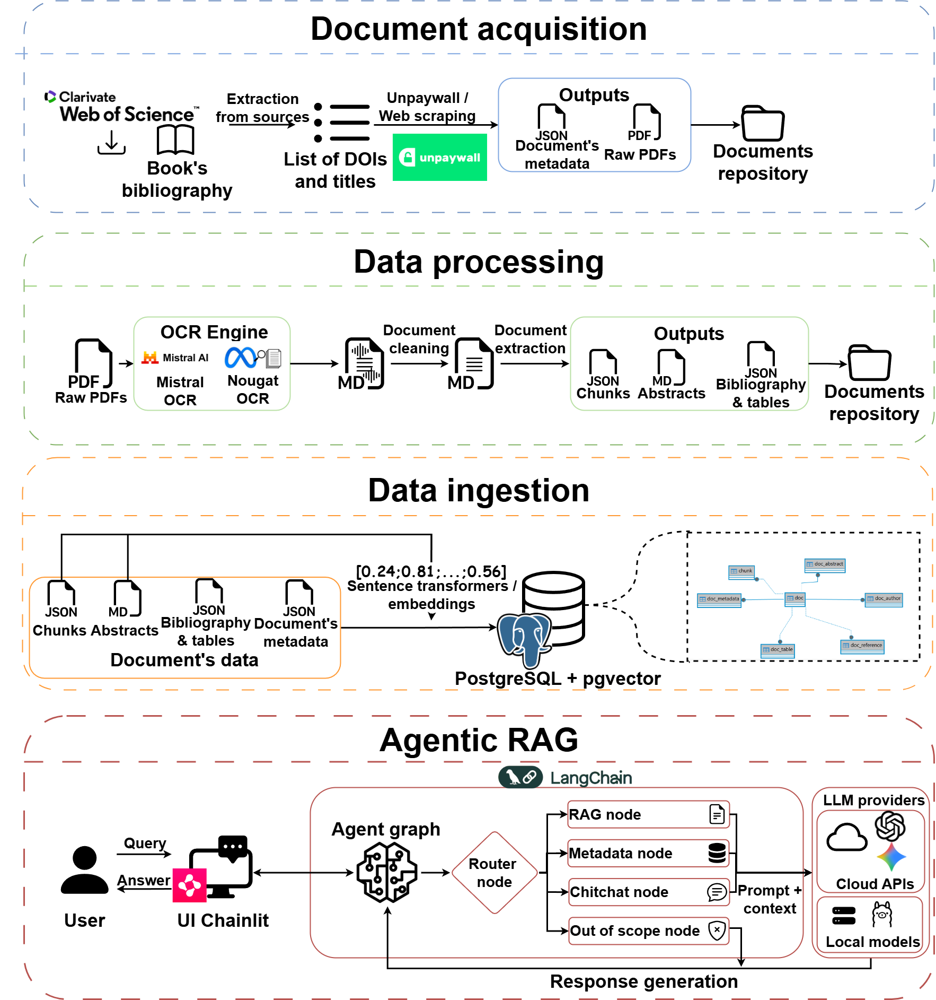
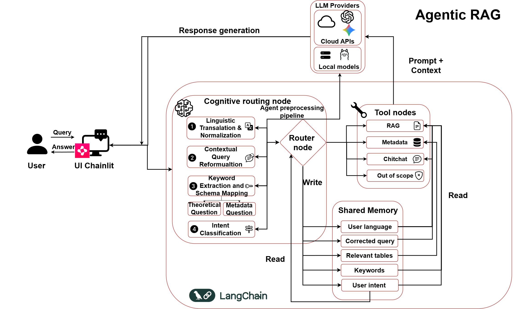

# TFM - Bayesian Network Agentic RAG

This repository contains the code developed for the master's thesis. The project implements an **agentic retrieval-augmented generation (RAG)** system focused on scientific literature about **Bayesian networks**.

The system covers the complete pipeline: document acquisition, OCR-based document processing, database ingestion, hybrid retrieval, agentic query routing, conversational response generation, and evaluation.

## General Architecture

The project is organized as a modular pipeline:

1. Scientific documents are collected from bibliographic sources.
2. PDFs are converted into Markdown using OCR tools.
3. Abstracts, bibliography, tables, metadata, and text chunks are extracted.
4. The processed information is ingested into a PostgreSQL database.
5. Embeddings are generated and stored for semantic retrieval.
6. An Agentic RAG application routes each user query to the appropriate tool.
7. The system is evaluated through retrieval, generation, and router benchmarks.



## Repository Structure

### `00_BBDD`

Contains the SQL DDL script used to create the PostgreSQL database schema.

It defines the required extensions, including `vector`, `unaccent`, `uuid-ossp`, and `pg_trgm`, and creates the main tables used by the system:

- `doc`: processed documents.
- `chunk`: document chunks with embeddings and full-text search vectors.
- `doc_abstract`: abstracts and their embeddings.
- `doc_metadata`: bibliographic metadata.
- `doc_author`: normalized author information.
- `doc_reference`: extracted bibliography entries.
- `doc_table`: tables extracted from papers.

### `01_DocumentsAdquisition`

This module is responsible for collecting the scientific documents used in the corpus.

It supports document acquisition from:

- APA-style bibliography entries.
- Web of Science exports containing DOI information.
- Open-access PDF discovery through the Unpaywall API.

When a direct PDF link is not available, the scripts attempt to inspect the landing page and locate a downloadable PDF. The module also stores metadata and logs failed downloads for later inspection.

### `02_DocumentsProcessing`

This module transforms raw PDFs into structured and clean textual artifacts ready for ingestion.

Main responsibilities:

- Run OCR processing with Mistral OCR or Nougat.
- Convert papers into Markdown.
- Extract abstracts using OCR-tolerant rules.
- Extract bibliography entries and tables.
- Detect document language.
- Clean Markdown content.
- Split papers into token-controlled chunks.
- Preserve formulas, code blocks, and tables through placeholders and metadata.

The main outputs are cleaned Markdown files, abstract files, metadata JSON files, bibliography/table JSON files, and chunk JSON files.

### `03_DataIngestion`

This module loads the processed artifacts into PostgreSQL.

It checks that each document has all required files before ingestion and avoids inserting duplicated documents. For each valid paper, it inserts:

- Document-level metadata.
- Authors.
- Abstracts.
- Bibliography entries.
- Extracted tables.
- Text chunks.
- Embeddings generated with `sentence-transformers`.

This step prepares the database for both lexical retrieval and dense vector retrieval.

### `04_AgenticRAG`

This is the main conversational application. It uses **Chainlit** for the user interface and **LangGraph** to define the agentic workflow.

The core component is a router node that classifies each user query into one of four categories:

- `BN`: domain-specific questions about Bayesian Networks. These are answered through RAG.
- `MD`: metadata questions. These are translated into SQL and answered using database results.
- `CC`: casual conversation or general chat.
- `OOC`: out-of-scope questions.

Main components:

- `app.py`: Chainlit entry point and response streaming.
- `graph/agent_graph.py`: LangGraph state, nodes, and routing logic.
- `services/retrieval.py`: hybrid retrieval pipeline combining BM25, dense retrieval over abstracts, dense retrieval over chunks, and re-ranking.
- `services/llm.py`: LLM chains for routing, RAG, SQL generation, and final responses.
- `tools/rag.py`: RAG node for Bayesian Network questions.
- `tools/metadata.py`: natural-language-to-SQL node for metadata queries.
- `tools/chitchat.py`: conversational fallback node.
- `tools/oos.py`: out-of-scope response node.
- `prompts/`: prompt templates used by the different nodes.



### `05_Evaluation`

This module contains the experimental evaluation code.

It includes scripts for:

- Embedding model benchmarking.
- Query generation.
- Golden chunk selection.
- RAG dataset generation.
- Generation evaluation.
- Router evaluation.
- Result visualization.

The objective of this module is to compare different configurations and support the methodological decisions described in the thesis.


## Installation

Create a virtual environment and install the dependencies:

```bash
python -m venv venv
pip install -r requirements.txt
```

PyTorch should be installed according to the available hardware. The `requirements.txt` file includes notes for CPU and CUDA installations.

## Configuration

The project uses environment variables for database and LLM configuration. These variables can be defined in a `.env` file:

```env
DB_HOST=
DB_PORT=
DB_DATABASE=
DB_USER=
DB_PASSWORD=
DB_SCHEMA=
OPENAI_API_KEY=
OPENAI_API_MODEL=
OPENAI_API_MODEL_ROUTER=
```

Each module also contains its own `config.py` file, where paths and execution parameters are defined.

## Typical Execution Flow

A typical execution order is:

```bash
python 01_DocumentsAdquisition/WOSDocumentsDownload.py
python 02_DocumentsProcessing/MistralOCRProcessing.py
python 02_DocumentsProcessing/LanguageDetection.py
python 02_DocumentsProcessing/AbstractExtractor.py
python 02_DocumentsProcessing/BibliographyTableExtraction.py
python 02_DocumentsProcessing/Chunking.py
python 03_DataIngestion/DataIngestion.py
```

To run the conversational application:

```bash
cd 04_AgenticRAG
chainlit run app.py
```

To run the evaluation module:

```bash
cd 05_Evaluation

# Embedding evaluation
python EMB_SelectingGoldenChunks.py
python EMB_GenerateQueries.py
python EMB_Benchmarking.py

# Generation evaluation
python GEN_Generation.py
python GEN_Benchmarking.py
python GEN_ShowResults.py
python GEN_ResultsPlots.py

# Router evaluation
python ROUTER_Benchmarking.py
```

The exact scripts to execute depend on the experiment being reproduced. Evaluation paths, model names, database schemas, and output files are configured in `05_Evaluation/eval_config.py`.

## Project Goal

The goal of the project is to build and evaluate an agentic RAG system capable of answering questions about Bayesian Networks using a custom scientific corpus. The system combines semantic retrieval, lexical retrieval, metadata querying, and automatic intent routing in a single conversational workflow.
